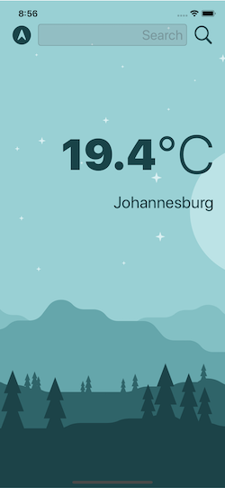

#  Clima - Weather App

## Complete Xcode Application for iOS


## To run on your Xcode

* Swift >= 4
* Xcode >= 10
* Free API Key from [Open Weather Map](https://openweathermap.org) 

## To Add API key follow the following steps
* Open project in Xode
* In Model Group open file WeatherManager.swift

```
let weatherURL = "https://api.openweathermap.org/data/2.5/weather?appid=YOUR_API_KEY&units=metric"
```
* Replace YOUR_API_KEY.

## Features of this APP
* Dark Mode Support for images using vectors
* Named Colors for Dark/Light mode support
* Current Location for weather where you are

## Swift Concepts Implemented
* Delegated and Protocols
* Extensions
* URL Sessions and Networking (API)
* CoreLocation

## App Preview

Dark Mode


Light Mode


## Note:
As I developed this app while learning, you can suggest new features in it, idea to make the code readabilty better.